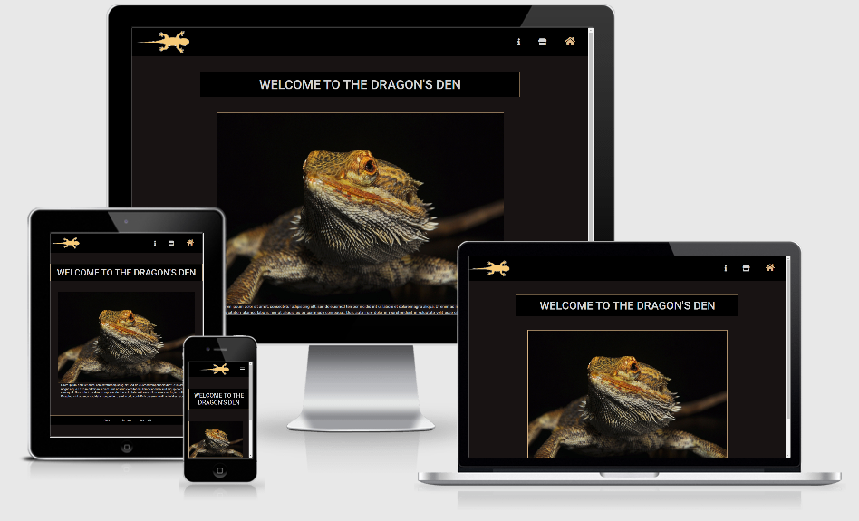

# BeardedDragonCentral.com

[View the site here!](https://jamiem-hub.github.io/JM-Milestone1-BeardedDragons/)

### A clean and fun source of information about the species, and guidance on keeping a bearded dragon as a pet!

## Project Goals
The core aim of the project is to provide consumers with a professional, appealing source of information about bearded dragons for pet-keepers and bearded dragon enthusiasts.

The secondary aim of the project is to act as a prototype for an affiliate marketing website, by funnelling Users looking to purchase pet equipment to Amazon Store pages.

## UX
The UI has been designed with style, intuition and simplicity at its core. The design aims to elevate the appeal of the bearded dragon through high quality images and detailed but easy-to-read information, and make the User journey as simple as possible.

Due to sizing and accessibility issues with smaller viewports and responsivity issues, many of the initial wireframe designs were revised to allow a more streamlined User Experience.

### Design

* __Colour scheme__ - The site contrasts a dark background (CSS charcoal and black) with lighter text and features (CSS lightgray, burlywood and darkorange). As a pimarily informational site, the high contrast allows the User to easily find and read the information they need. To maximise User enggement, the highlight colour matches the most popular species of bearded dragon (pogona...).
* __Typography__ - Rubik is used to keep the information simple and easy to read. The headers are styled with Roboto to give the site a professional finish.
* __Imagery__ - Various high-quality images of the same bearded dragon are used as hero images to tie the website together and increase User engagement.

### User Stories
The UI has been designed with style and intuition at its core. The design aims to elevate the appeal of the bearded dragon through high quality images and detailed but easy-to-read information, and make the User journey as simple as possible.

* A User purely seeking information or doing research on bearded dragons:
    * As a User, I want easy-to-locate, easy-to-read information
    * As a User, I want clean and appealing presentation of information
    * As a User, I want external links for further reading
* A User seeking specific information on buying and keeping bearded dragons:
    * As a User, I want robust and detailed information on my specific issue
    * As a User, I want an intuitive and easy-to-locate contents list for different specific issues
    * As a User, I want a professional-looking website I can trust as a reputable source
* A User looking to buy bearded dragon pet equipment:
    * As a User, I want easy-to-locate information on what equipment I may need and why
    * As a User, I want clear, unambiguous links to an appropriate merchant page listed next to the relevant section of information
    * As a User, I want clear information about which specific vendor I will be purchasing from, and what to do if there is an issue with my order
    * As a User, I want contact details so I can get in touch with a website official with any concerns

### Wireframes
* Home Page (desktop) - [View](./wireframes/dragon-milestone-wireframe-index-lrg)
* Home Page (tablet) - [View](./wireframes/dragon-milestone-wireframe-index-med)
* Home Page (mobile) - [View](./wireframes/dragon-milestone-wireframe-index-sml)
* Home Page (mobile w/ dropdown) - [View](./wireframes/dragon-milestone-wireframe-index-sml-expand)
* Guide/Store Page (desktop) - [View](dragon-milestone-wireframe-guide-lrg)
* Guide/Store Page (mobile) - [View](dragon-milestone-wireframe-guide-sml)

## Features

* __A Brief History of Dragons__ – A page of general information and points of interest relating to the bearded dragon and its species’ variants.
* __Dragon Owner’s Guide__ – A beginner’s guide to buying and keeping a bearded dragon as a pet.
* __Amazon Integration__ – A link for every piece of equipment featured in the Dragon Owner’s Guide, leading directly to an Amazon store page for that product. The user will be warned about opening a link to an external site.

## Technologies 
### Languages Used
* [HTML5](https://en.wikipedia.org/wiki/HTML5)
* [CSS3](https://en.wikipedia.org/wiki/CSS)
* [JavaScript](https://en.wikipedia.org/wiki/JavaScript)
* [jQuery](https://jquery.com/)

### Dependancies
* [Bootstrap](https://getbootstrap.com)
* [Font Awesome](https://fontawesome.com/)
* [Google Fonts](https://fonts.google.com/)

## Testing
### Known Bugs

* The footer buttons will call a modal dialog containing relevant information. However, the modal dialog position should be centered for all viewports and currently the dialog will display off-center and the offset increases as the viewport is widened.

* The header lizard logo retains some MS Paint artefacts.

## Deployment

## Credits
### Media
Creative Commons images and text were pulled from the following sources:
* [Wikipedia](https://en.wikipedia.org/wiki/Pogona)
* [Wikipedia Commons](https://commons.wikimedia.org/)
* [The Spruce Pets](https://www.thesprucepets.com/bearded-dragons-as-pets-1236896)
* [Pixabay](https://pixabay.com/vectors/lizard-iguana-gecko-animal-nature-151209/)

### Resources
I found useful advice and code snippets from the following sources:
* [Bootstrap](https://getbootstrap.com)
* [w3schools](https://w3schools.com)
* [Goolge Fonts](https://fonts.google.com/)
* [Mozilla](https://developer.mozilla.org/en-US/docs/Web)
* [CSS Tricks](https://css-tricks.com/)
* [Stack Overflow](https://stackoverflow.com/)

### Acknowledgements
* Thank you to Code Institute for giving me the tools to create this website
* Thank you to my mentor Aaron for his advice and assistance
* Thank you to the world's population of bearded dragons for being the inspration to create this website