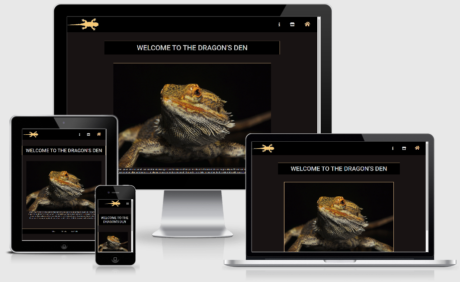

# The Dragon's Den

[View the site here!](https://jamiem-hub.github.io/JM-Milestone1-BeardedDragons/)

A clean, professional and fun source of information about the bearded dragon, guidance on how to keep one as a pet, and links to the equipment you need to keep your own dragon!

## Project Goals
The core aim of the project is to provide consumers with a professional, appealing source of information about bearded dragons for pet-keepers and bearded dragon enthusiasts.

The secondary aim of the project is to act as a prototype for an affiliate marketing website, by funnelling Users looking to purchase pet equipment to Amazon Store pages.

## UX
The UI has been designed with style and intuition at its core. The design elevates the appeal of the bearded dragon through high quality images and detailed easy-to-read information. The UI also focuses on making the User journey as simple as possible.

Due to sizing and accessibility issues with smaller viewports and responsivity issues, some wireframe designs were revised to allow a more streamlined User Experience.

### Design

* __Colour scheme__ - The site contrasts a dark background (CSS charcoal and black) with lighter text and features (CSS lightgray, burlywood and darkorange). As a pimarily informational site, the high contrast allows the User to easily find and read the information they need. The highlight colour matches the most popular species of bearded dragon to maximise User engagement.
* __Typography__ - Rubik is used to keep the information simple and easy to read. Roboto is used to give headers a bold, professional finish.
* __Imagery__ - High-quality images of the same bearded dragon are used as hero images to tie the website together and increase User engagement.

### User Stories

* A User purely seeking information or doing research on bearded dragons:
    * As a User, I want easy-to-locate, easy-to-read information
    * As a User, I want clean and appealing presentation of information
    * As a User, I want external links for further reading
* A User seeking specific information on buying and keeping bearded dragons:
    * As a User, I want robust and detailed information on my specific issue
    * As a User, I want an intuitive and easy-to-locate contents list for different specific issues
    * As a User, I want a professional-looking website I can trust as a reputable source
* A User looking to buy bearded dragon pet equipment:
    * As a User, I want easy-to-locate information on what equipment I may need and why
    * As a User, I want clear, unambiguous links to an appropriate merchant page listed next to the relevant section of information
    * As a User, I want clear information about which specific vendor I will be purchasing from, and what to do if there is an issue with my order
    * As a User, I want contact details so I can get in touch with a website official with any concerns

### Wireframes
* Home Page (desktop) - [View](./wireframes/dragon-milestone-wireframe-index-lrg)
* Home Page (tablet) - [View](./wireframes/dragon-milestone-wireframe-index-med)
* Home Page (mobile) - [View](./wireframes/dragon-milestone-wireframe-index-sml)
* Home Page (mobile w/ dropdown) - [View](./wireframes/dragon-milestone-wireframe-index-sml-expand)
* Guide/Store Page (desktop) - [View](dragon-milestone-wireframe-guide-lrg)
* Guide/Store Page (mobile) - [View](dragon-milestone-wireframe-guide-sml)

## Features

* __A Brief History of Dragons__ – A page of general information and points of interest relating to the bearded dragon and its species’ variants.
* __Dragon Owner’s Guide__ – A beginner’s guide to buying and keeping a bearded dragon as a pet.
* __Amazon Integration__ – A link for every piece of equipment featured in the Dragon Owner’s Guide, leading directly to an Amazon store page for that product. The user will be warned about opening a link to an external site.

## Technologies 
### Languages Used
* [HTML5](https://en.wikipedia.org/wiki/HTML5)
* [CSS3](https://en.wikipedia.org/wiki/CSS)
* [JavaScript](https://en.wikipedia.org/wiki/JavaScript)
* [jQuery](https://jquery.com/)

### Dependancies
* [Bootstrap](https://getbootstrap.com)
* [Font Awesome](https://fontawesome.com/)
* [Google Fonts](https://fonts.google.com/)

## Testing
After human proof reading all HTML and CSS files they were validated again using  and  to ensure no unknown bugs are present. Some minor code formatting bugs were thrown that do not affect User experience or website functionality.

Site was tested on Google Chrome and Mozilla Firefox at every breakpoint and was found to respond satisfactorily.

### Testing User Stories
* A User purely seeking information or doing research on bearded dragons:
    * As a User, I want easy-to-locate, easy-to-read information
        * I click one of the navbar icons and I'm taken to a page full of information
    * As a User, I want clean and appealing presentation of information
        * I each page I visit has a basic colour scheme and a good level of contrast for reading
    * As a User, I want external links for further reading
        * I visit the Info page and then visit the Guide page, where I'm able to go to an external site for buying bearded dragons and click an external link about keeping bearded dragons as pet
* A User seeking specific information on buying and keeping bearded dragons:
    * As a User, I want robust and detailed information on my specific issue
        * I want to know how to keep a bearded dragon so I locate the guide page and learn what kind of vivarium I need to house a bearded dragon.
    * As a User, I want an intuitive and easy-to-locate contents list for different specific issues
        * I'm looking for information on various parts of a robust vivarium and find links leading me directly to all necessary items
    * As a User, I want a professional-looking website I can trust as a reputable source
        * As I view the site, I don't find any visual or functional issues (with the exception of the offset footer modal) which makes me think that the website was professionally produced and as such, the information is trustworthy.
* A User looking to buy bearded dragon pet equipment:
    * As a User, I want easy-to-locate information on what equipment I may need and why
        * I visit the site and go to the Guide page, and immediately find information on reptile pet equipment
    * As a User, I want clear, unambiguous links to an appropriate merchant page listed next to the relevant section of information
        * I visit the Guide page, find the equipment I want, click the Buy Now button and end up at an Amazon page for the equipment I want
    * As a User, I want clear information about which specific vendor I will be purchasing from, and what to do if there is an issue with my order
        * I visit the Guide page, have a security question, click the About button at the bottom of the page, and discover that all Buy Now links lead to Amazon.com
    * As a User, I want contact details so I can get in touch with a website official with any concerns
        * I visit any page and click the Contact button at the bottom of the page. I am given the email address for website staff and invited to contact them with any issues

### Known Bugs

* The footer buttons will call a modal dialog containing relevant information. However, the modal dialog position should be centered for all viewports and currently the dialog will display off-center and the offset increases as the viewport is widened.
* The header lizard logo retains some MS Paint artefacts.

## Deployment
### Deploying to GitHub

You can deploy this project to GitHub by doing the following:

1. Log in to your GitHub account and search for/locate this repository
2. Click the 'Settings'button at the top of the page
3. Find the 'GitHub Pages' section
4. Make sure 'main' is selected on the 'Branch' dropdown
5. Click the newly-created link with a green tick next to it.
6. Enjoy the website!

### Forking the GitHub Repository
You can fork this GitHub Repository if you wish to make a copy of the original repository on your GitHub account without affecting the original respository:

1. Log in to your GitHub account and search for/locate this repository
2. Click the 'Fork' button at the top of the page
3. Your GitHub account will now have an exact copy of the project that you can edit

### Making a Local Clone
1. Log in to your GitHub account and search for/locate this repository
2. Click the 'Code' dropdown and select your cloning method
3. If you have GitHub Desktop, click the GitHub Desktop button
    * The application will open with this repository available for editing
4. If you're using an alternative Git service
    1. Open Git Bash
    2. Make sure the current working directory is set to the location where you want to place the clone.
    3. Type 'git clone' in your command line and paste the URL given on the GitHub repository page

## Credits
### Media
Creative Commons images and text were pulled from the following sources:
* [Wikipedia](https://en.wikipedia.org/wiki/Pogona)
* [Wikipedia Commons](https://commons.wikimedia.org/)
* [The Spruce Pets](https://www.thesprucepets.com/bearded-dragons-as-pets-1236896)
* [Pixabay](https://pixabay.com/vectors/lizard-iguana-gecko-animal-nature-151209/)

### Resources
I found useful advice and code snippets from the following sources:
* [Bootstrap](https://getbootstrap.com)
** Modals, Collapses and Dropdowns were copied and modified
* [w3schools](https://w3schools.com)
* [Google Fonts](https://fonts.google.com/)
* [Stack Overflow](https://stackoverflow.com/)

### Acknowledgements
* Thank you to Code Institute for giving me the tools to create this website
* Thank you to my mentor Aaron for his advice and assistance
* Thank you to the world's population of bearded dragons for being the inspration to create this website